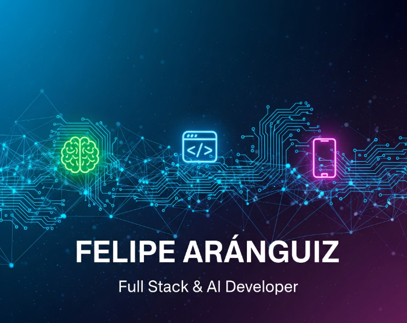
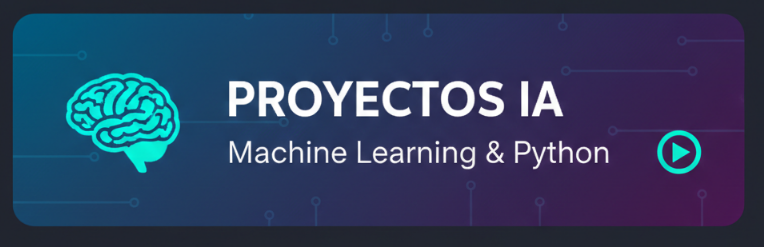
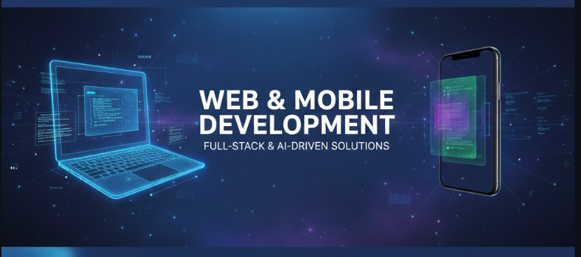
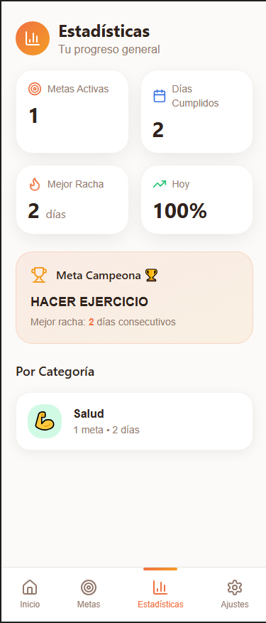
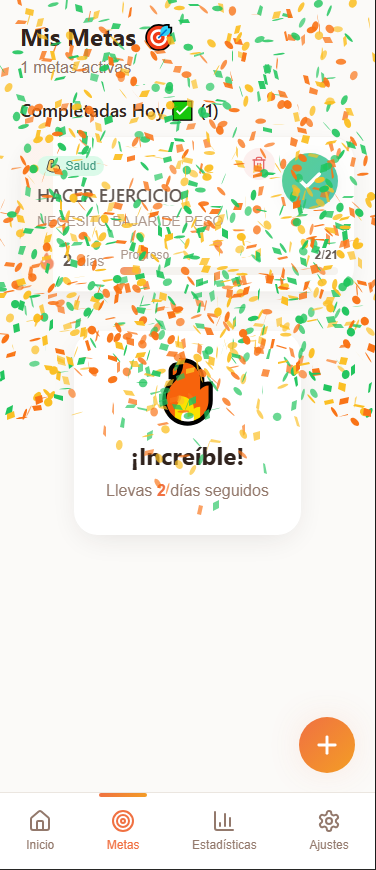
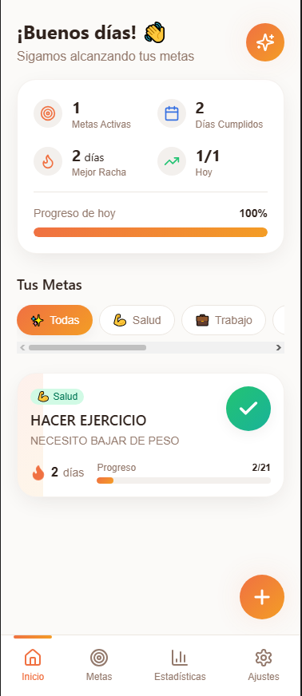
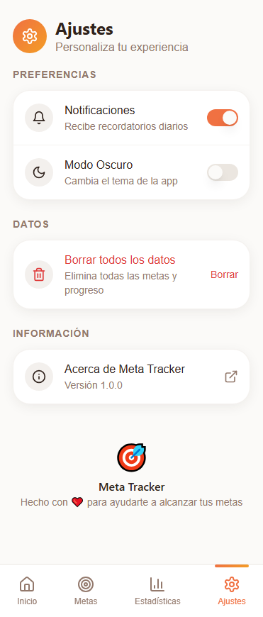
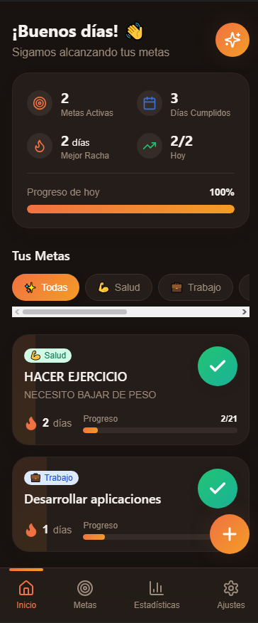
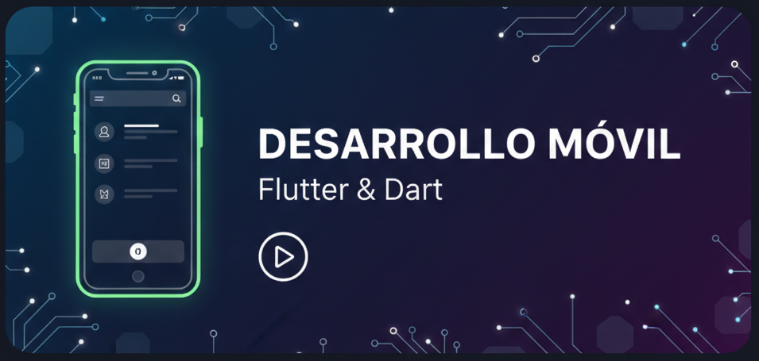

<h1 align="center">Felipe Aránguiz | Full Stack & AI Developer 🚀</h1>

<table align="center" border="0">
  <tr>
    <td align="center">
      
       
      <h4 align="center">
        <b><a href="https://www.linkedin.com/in/felipearang/">LinkedIn</a></b>
        &nbsp; • &nbsp;
        <b><a href="https://github.com/meme11-co">GitHub</a></b>
        &nbsp; • &nbsp;
        <b><a href="mailto:felipe.32.7b@gmail.com">Contacto</a></b>
      </h4>
    </td>
  </tr>
</table>

## 🤖 Sobre mí
Ingeniero Civil Informático apasionado por la convergencia entre la **Inteligencia Artificial** y el desarrollo **Full Stack (Web & Mobile)**. Actualmente enfocado en la arquitectura Cloud con AWS y la automatización inteligente de procesos.

## 🚀 Proyectos Destacados

<table align="center">
  <tr>
    <td width="50%" align="center">
       
      <b>Proyecto IA & Machine Learning</b> 
      <i>Optimización de procesos con ML</i> 
      <a href="https://github.com/meme11-co">Ver Repositorio 🔗</a>
    </td>
    <td width="50%" align="center">
       
      <b>Desarrollo Móvil & Web</b> 
      <i>App multiplataforma en Flutter + Django</i> 
      <a href="https://github.com/meme11-co">Ver Repositorio 🔗</a>
    </td>
  </tr>
</table>

---

## 🛠️ Tech Stack & Herramientas

  
  
  
  
  

---
## 🛠️ Portafolio Detallado
## 📂 Galería de Proyectos (Acordeón)

## 📂 Galería de Proyectos e Imágenes

<i>Haz clic para desplegar las capturas de pantalla de mi trabajo</i>

---

  
<b>🤖 Proyectos de Inteligencia Artificial (ML)</b>

   
  

    
    
  

  <blockquote>
    Modelos predictivos y análisis de datos avanzados para optimización de procesos industriales.
  </blockquote>

  
<b>📱 Desarrollo Full Stack & Mobile</b>

   
  

    
    
  

  <blockquote>
    Interfaces modernas y funcionales desarrolladas con Flutter y Next.js.
  </blockquote>

  
<b>☁️ Infraestructura Cloud & AWS</b>

   
  

    
    
  

  <blockquote>
    Implementación de servicios escalables y seguros en la nube de Amazon Web Services.
  </blockquote>

  
<b>🛠️ Otros Recursos y Certificaciones</b>

   
  

    
  

---

---
## ⚡ Datos Curiosos
- ♟️ Jugador de ajedrez y entusiasta del **One Piece TCG**.
- 🎲 Dungeon Master ocasional en **D&D**.
- 🧟 Sobreviviente profesional en **Project Zomboid**.
